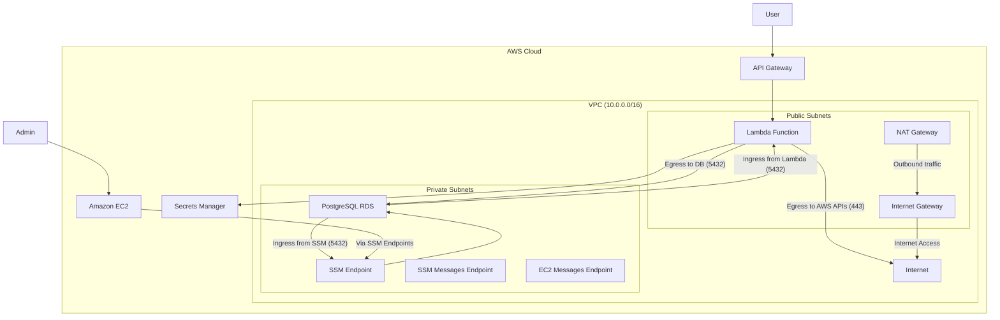

# Infrastructure Documentation

This document describes the AWS infrastructure defined in `template.yaml` for the ServiceLifecycle Lambda with PostgreSQL example.

## Architecture Overview

The infrastructure consists of a secure VPC setup with public and private subnets, a Lambda function in public subnets, and an RDS PostgreSQL database in private subnets. The architecture follows AWS best practices for security and connectivity.



## Key Components

### Networking

1. **VPC**: A dedicated VPC with CIDR block `10.0.0.0/16`
2. **Subnets**:
   - Public Subnets (10.0.1.0/24, 10.0.2.0/24): For Lambda and NAT Gateway
   - Private Subnets (10.0.3.0/24, 10.0.4.0/24): For RDS and VPC endpoints
3. **Internet Gateway**: Provides internet access for public subnets
4. **NAT Gateway**: Allows outbound internet access from private subnets
5. **Route Tables**: Separate route tables for public and private subnets

### Security

1. **Security Groups**:
   - **Lambda Security Group**: Restricts outbound traffic to:
     - PostgreSQL (5432) within the VPC
     - HTTPS (443) to the internet
   - **Database Security Group**: Allows inbound PostgreSQL connections only from:
     - Lambda Security Group
     - SSM Endpoint Security Group
   - **SSM Endpoint Security Group**: Allows HTTPS inbound for SSM connections

2. **Encryption**:
   - RDS storage encryption enabled
   - SSL/TLS for database connections with certificate verification
   - Secrets Manager for secure credential storage

### Compute & Database

1. **Lambda Function**:
   - Runtime: provided.al2 (Swift)
   - Memory: 512MB
   - Timeout: 60 seconds
   - VPC integration with public subnets

2. **RDS PostgreSQL**:
   - Instance class: db.t3.micro
   - Engine version: 15.7
   - Storage: 20GB gp2
   - Placed in private subnets
   - Not publicly accessible

### Access & Management

1. **Secrets Manager**:
   - Stores database credentials
   - Auto-generates secure password
   - Referenced by Lambda and RDS

2. **VPC Endpoints**:
   - SSM Endpoint
   - SSM Messages Endpoint
   - EC2 Messages Endpoint
   - Enables CloudShell access to private resources

3. **Function URL**:
   - HTTP endpoint for invoking Lambda function

## Security Considerations

1. **Network Isolation**: Database is in private subnets, not directly accessible from the internet
2. **Least Privilege**: Security groups follow principle of least privilege
3. **Encryption**: Data at rest is encrypted
4. **Secure Credentials**: No hardcoded credentials, using Secrets Manager
5. **SSL/TLS**: Database connections use SSL/TLS with certificate verification

## Accessing the Database

The database is in a private subnet and not directly accessible from the internet. To connect:

1. **From Lambda**: Direct connection through VPC networking
2. **From Amazon EC2**: Through SSM VPC endpoints
3. **From your local machine**: Options include:
   - SSH tunnel through a bastion host
   - AWS Session Manager port forwarding
   - AWS Cloud9 environment in the same VPC

## Deployment

Deploy this infrastructure using AWS SAM:

```bash
sam deploy
```

## Outputs

After deployment, the following information is available in CloudFormation outputs:

- API Gateway endpoint URL
- Database endpoint hostname and port
- Database name
- Secret ARN for retrieving credentials
- Connection instructions

## Cost Optimization

The template uses cost-effective resources:
- db.t3.micro RDS instance (eligible for free tier)
- Minimal storage allocation (20GB)
- Single-AZ deployment
- No automated backups

For production workloads, consider adjusting these settings based on your requirements.