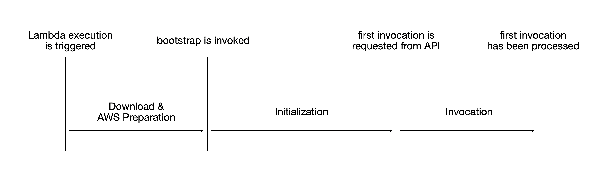
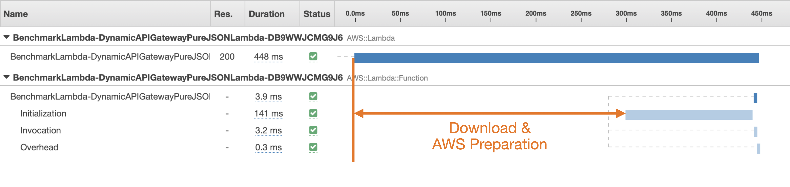

# Swift AWS Lambda Runtime Performance

This document strives to give the reader some insight into the performance of Swift AWS Lambda Runtime. Lamba performance is usally measured by two main metrics: 

- **Cold start times**: The time it takes for a Lambda to startup, ask for an invocation and process the first invocation.
- **Warm invocation times**: The time it takes for a Lambda to process a trivial invocation after the Lambda has been invoked at least once. The goal is determine how big the processing overhead is of a given runtime and language. 

## Cold start

A Lambda cold start consist out of three phases:

1. **Download and AWS preparation**: The executable is downloaded and unzipped for invocation. AWS prepares a new microVM in which the Lambda will be executed.
2. **Initialization**: The bootstrap executable is invoked within the microVM. `[Fixme: invoked? Better word needed...]` This starts the runtime which connects to the [AWS Lambda runtime interface](https://docs.aws.amazon.com/lambda/latest/dg/runtimes-api.html) to get an invocation to be processed. 
3. **Invocation**: This is the time passed between receiving the first invocation from the Lambda runtime interface and responding with a result.

// Fixme: better alt text

The cold start time of Lambda is determined by multiple factors:

- The **zipped executable size** affects the time download and unzip time.  
- **Dynamic linking** affects the time it takes before the executable can connect to the Lambda runtime interface for the very first time and is therefore influencing the initialization time.
- Runtime performance (how direct/fast is the code path to connect to the Lambda runtime interface) influences the initialization and invocation times.

### Dynamically linking Swift libraries

Swift links against its runtime libraries other than go or rust dynamically. This means: We need to include all libraries needed for running Swift with our executable.

Since the Swift runtime libraries itself depend on a number of Linux system libraries, the number of linked Swift libraries affects the invocation time.

But even by not linking Foundation at all the time spent for dynamic linking is lowered quite significantly.

### Using Swift Lambda Runtime in Swift-NIO only mode

## Measuring

## Parameters

## Warm start

